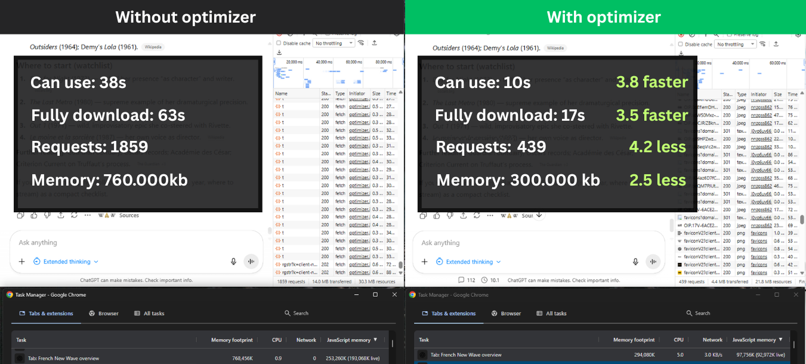

# GPT Performance Optimizer — Chrome MV3 Extension



<details>
  <summary><i>🎞️ The Video Demonstration</i></summary>
<p>https://github.com/user-attachments/assets/8d118a5a-6044-4c43-ad11-56ca585b3c9a</p>
</details>

Production-ready MV3 extension that intercepts ChatGPT conversation data before React ingests it, clamps to the last N messages to keep long chats fast, and provides a clean UI to reveal older messages on demand.

⚠️ When you reveal hidden messages, they’re shown in a simplified form. Some features may be limited. If you’re missing something you need, email me at pimenov.web@gmail.com and I’ll do my best to add it.

⚠️ Due to technical reasons (on ChatGPT’s side), it doesn’t work in ‘share’ chats such as https://chatgpt.com/share/*

## What it does

ChatGPT loads the entire conversation into React state, which slows down long chats. This extension:

1. Intercepts conversation data before React ingests it (fetch, ReadableStream, EventSource, bootstrap JSON)
2. Clamps to the last N messages (default tail is configurable via the popup or per-conversation)
3. Stores the full “flat” conversation in localStorage (off-React) with metadata to safely rehydrate
4. Provides a toolbar to load older messages on demand (+10 previous, Show all, reset to default)
5. Renders older messages outside React (plain DOM) so React’s state stays small
6. Adds a minimalist status bar showing total messages and load time (in seconds)

## Installation

1. Open Chrome and navigate to `chrome://extensions/`
2. Enable "Developer mode" (toggle in top-right)
3. Click "Load unpacked"
4. Select the `extention/` folder

## Structure

```
extention/
├── manifest.json          # MV3 manifest with content_scripts (MAIN & ISOLATED worlds)
├── popup.html             # Settings popup UI
├── popup.js               # Popup logic (default tail, enable/disable, verbose logs)
├── util/
│   ├── settings-loader.js # ISOLATED: chrome.storage.sync → localStorage bridge + events
│   ├── logger.js          # Buffered logger on window; console gated by cl:log:verbose
│   └── shared.js          # Central utilities (IDs, traversal, tool filtering)
├── core/
│   ├── optimizer.js       # Core config, storage helpers (localStorage), fetch hook
│   └── stream-hooks.js    # ReadableStream, EventSource, bootstrap JSON, SPA watcher
├── lib/
│   ├── marked.min.js      # Markdown parser
│   ├── purify.min.js      # HTML sanitizer
│   └── highlight.min.js   # Code syntax highlighting
├── theme/
│   ├── clx-icons.js       # SVG icons
│   └── clx-theme.js       # CSS, Markdown rendering, article creation
└── ui/
   ├── toolbar.js         # Toolbar (+10 / Show all / reset) and status bar
   └── loader.js          # Loading overlay + load time capture (ms)
```

## How it works

### Five intercept points (all required)

1. Fetch API (`core/optimizer.js`)
   - Intercepts `/backend-api/conversation/:id`
   - Trims mapping to last N renderable messages
   - Returns rewritten JSON to React

2. ReadableStream (`core/stream-hooks.js`)
   - Patches `ReadableStream.prototype.getReader().read()`
   - Transforms streaming flight frames before React consumes them

3. EventSource (`core/stream-hooks.js`)
   - Wraps EventSource message listeners
   - Transforms SSE frames containing conversation data

4. Bootstrap JSON (`core/stream-hooks.js`)
   - Rewrites inline `<script type="application/json">` when mapping detected
   - Catches conversation data embedded in the page

5. React Router streaming path (`core/stream-hooks.js`)
   - Mapping replacement + SPA watcher during navigation

### Data flow:

```
Initial load → Fetch/Stream/Bootstrap interceptors → Trim to N messages → React (small state)
                                    ↓
                           Store full conversation
                           in localStorage
                                    ↓
                           Toolbar injects older
                           messages as plain DOM
```

## Settings & debugging

### Popup settings
- Default messages to show (tail)
- Enable optimizer (on/off)
- Verbose logs (developer)
- Enable optimizer for this page (appears when a chat tab is active)

Settings are persisted in `chrome.storage.sync` and bridged to `localStorage` for runtime access in the MAIN world.

Per-page switch: use the popup’s “Enable optimizer for this page” (visible when a chat tab is active) to override only the current conversation.

### Console debugging

Open DevTools console and check for logs:

- `[ChatGPT-Opt] core:ready` - Core optimizer loaded
- `[ChatGPT-Opt] stream:init:complete` - Stream hooks installed
- `[ChatGPT-Opt] fetch:trimmed` - Conversation trimmed (shows total/kept counts)
- `[ChatGPT-Opt] stream:readablestream:patched` - ReadableStream hook active
- `[ChatGPT-Opt] stream:eventsource:patched` - EventSource hook active
- `[ChatGPT-Opt] stream:bootstrap:patched` - Bootstrap JSON interceptor active

Tip: The logger is buffered and quiet by default. Enable console output via popup “Verbose logs (developer)” or in console: `window.TailLog.setVerbose(true)`.

## LocalStorage schema

- `cl:global-settings` — `{ defaultTail: number, optimizerEnabled: boolean }`
- `cl:tail:<conversation-id>` — Number of messages to keep (default 10, min 10, max 800)
- `cl:meta:<conversation-id>` — `{ renderableTotal, keptRenderableByReact }`
- `cl:flat:<conversation-id>` — Flat array `[{id, role, text, time}, ...]`
- `cl:inj:<conversation-id>` — Count of injected older messages
- `cl:last-load-ms:<conversation-id>` — Last measured load time in ms
- `cl:log:verbose` — `'1'` enables console output for buffered logger
- `cl:loader` — `'1'` or `'0'` to enable/disable loading overlay

## Features

✅ Works on `/c/<uuid>` conversation pages  
✅ Handles SPA navigation (no page reload needed)  
✅ Toolbar with Show all / +10 previous / reset controls (respects global default)  
✅ Scroll anchoring after +N insert (viewport stays at boundary)  
✅ Markdown rendering with code highlighting and copy buttons  
✅ Loading overlay while thread mounts; auto-hides error after ~2s  
✅ Status bar with total messages + seconds (live timer)  
✅ Preserves conversation structure (parent/children/current_node)  
✅ Filters tool noise and reasoning tokens  
✅ Quiet buffered logger with optional verbose console  
✅ Settings popup (default tail, enable optimizer, verbose logs)
✅ Per-page ON/OFF toggle in popup (overrides global just for current conversation)

## Differences from userscript

- MV3 content scripts in MAIN world patch fetch/streams directly; a separate ISOLATED script bridges settings
- SPA navigation watcher included (URL and conversation ID changes dispatch `cl:navigation-changed`)
- Logger is buffered by default; console verbosity is user-controlled (popup or `TailLog.setVerbose(true)`) 

## Troubleshooting

### Extension not loading
- Check `chrome://extensions/` for errors
- Verify all files are present (see structure above)
- Check browser console for script errors

### Clamping not working
- Open DevTools console
- Look for `[ChatGPT-Opt] fetch:trimmed` or `stream:shrink` logs
- If missing, the fetch/stream hooks aren't running
- Verify you're on `chatgpt.com` or `chat.openai.com`

### Toolbar not appearing
- Toolbar waits for first `<article>` in the thread
- Check console for errors in `ui/toolbar.js`
- Verify `theme/clx-theme.js` loaded (provides makeArticle)

## Configuration

### Change default tail
- Recommended: open the extension popup and set “Default messages to show”
- Advanced per-conversation override:
```javascript
// In console (advanced):
localStorage.setItem('cl:tail:<conversation-id>', '20');
```

### Disable loader
```javascript
// In console:
localStorage.setItem('cl:loader', '0');
```
